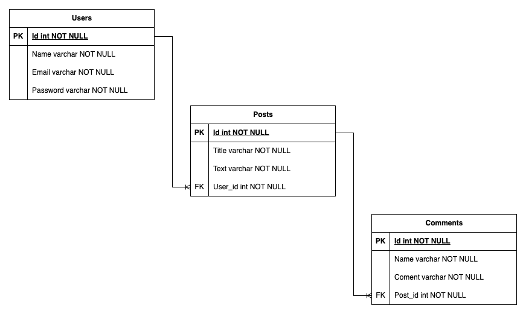

# Publications API

### Ruby on Rails

This application requires:

- ruby 3.0.3

### Database

This application uses Postgresql 12.1 with ActiveRecord

## Deploy local through RVM and Ruby

```bash
rvm install 3.0.3
```

Learn more about [RVM](https://rvm.io/rvm/install) installation

### Install dependencies

Using [Bundler](https://github.com/bundler/bundler)

```bash
gem install bundler
bundle
```

### Set environment variables

Using [dotenv](https://github.com/bkeepers/dotenv)

```bash
cp .env.local.example .env
```

Note: This .env.local.sample file is an example, it should be modified according to the user's connection settings.

```bash
DB_USER=postgres
DB_PASSWORD=postgres
DB_HOST=localhost
DATABASE=publications
```

### Create a copy of database configurations for local development

Run this command to enable the database configuration file

```bash
cp config/database.yml.example config/database.yml
```

### Task for initial development setup

```bash
rails db:create
rails db:migrate
```

### Start rails server

```bash
rails s -b 0.0.0.0 -p 3000
```

### Automated tests

This project has automated tests.

```bash
bundle exec rspec
```

This command will test controller, helper and trigger an automatic web execution test.

To test the integrity of the code, run the command below.

```bash
rubocop
```

This test will validate the syntax of all code and what can be improved.

### This project has the following database structure


